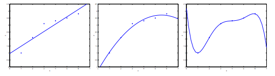

\renewcommand{\vec}[1]{\mathbf{#1}}
\usepackage{gensymb}

# 5. Multivariate Linear Regression
## 5.1 Multiple Features
Linear regression with multiple variables is also known as "multivariate linear regression".

We now introduce notation for equations where we can have any number of input variables.

$x^{(i)}_{j}=$ value of feature $j$ in the $i$th training example

$x^{(i)}=$ the input (features) of the $i$th training example

$m=$ the number of training examples

$n=$ the number of features

The multivariable form of the hypothesis function accommodating these multiple features is as follows:

$$
h_{\theta}(x)=\theta_{0}+\theta_{1}x_{1}+\theta_{2}x_{2}+\theta_{3}x_{3}+\cdots+\theta_{n}x_{n}
$$

In order to develop intuition about this function, we can think about $\theta_{θ}$ as the basic price of a house, $\theta_{1}$ as the price per square meter, $\theta_{2}$ as the price per floor, etc. $x_{1}$ will be the number of square meters in the house, $x_{2}$ the number of floors, etc.

Using the definition of matrix multiplication, our multivariable hypothesis function can be concisely represented as:

$$
h_{\theta}(x)=
\begin{bmatrix}
\theta_{0} & \theta_{1} & \cdots & \theta_{n} 
\end{bmatrix}
\begin{bmatrix}
x_{0} \\ x_{1} \\ \vdots \\ x_{n}
\end{bmatrix}
=\theta^{T}x
$$

This is a vectorization of our hypothesis function for one training example; see the lessons on vectorization to learn more.

Remark: Note that for convenience reasons in this course we assume $x^{(i)}_{0}=1$ for ($i\in1,\dots,m)$. This allows us to do matrix operations with $\theta$ and $x$. Hence making the two vectors $\theta$ and $x^{(i)}_{0}$ match each other element-wise (that is, have the same number of elements: $n+1$).

## 5.2 Gradient Descent for Multiple Variables
The cost function of multiple linear regression is:

$$
J(\theta_{0}, \theta_{1}, \dots, \theta_{n})=\frac{1}{2m}\sum_{i=1}^{m}(h_{\theta}(x^{(i)})-y^{i})^2
$$

The gradient descent equation itself is generally the same form; we just have to repeat it for our $n$ features:

`repeat until convergence:`
{
$$
\theta_{0}:=\theta_{0}-\alpha\frac{1}{m}\sum_{i=1}^{m}(h_{\theta}(x^{(i)})-y^{i})\cdot x_{0}^{(i)}
$$
$$
\theta_{1}:=\theta_{1}-\alpha\frac{1}{m}\sum_{i=1}^{m}(h_{\theta}(x^{(i)})-y^{i})\cdot x_{1}^{(i)}
$$
$$
\theta_{2}:=\theta_{2}-\alpha\frac{1}{m}\sum_{i=1}^{m}(h_{\theta}(x^{(i)})-y^{i})\cdot x_{2}^{(i)}
$$
$$
...
$$
}

In other words:

`repeat until convergence:`
{
$$
\theta_{j}:=\theta_{j}-\alpha\frac{1}{m}\sum_{i=1}^{m}(h_{\theta}(x^{(i)})-y^{i})\cdot x_{j}^{(i)}
$$

`for` $j:=0, 1,2,...,n$

}

The vectorized form of this algorithm can be represented as:
$$\theta=\theta-\frac{\alpha}{m}X^T(X\theta-y)$$

The following image compares gradient descent with one variable to gradient descent:


## 5.3 Gradient Descent in Practice I - Feature Scaling
We can speed up gradient descent by having each of our input values in roughly the same range. This is because $\theta$ will descend quickly on small ranges and slowly on large ranges, and so will oscillate inefficiently down to the optimum when the variables are very uneven.

The way to prevent this is to modify the ranges of our input variables so that they are all roughly the same. Ideally:

$$
−1 \leq x_{(i)} \leq 1
$$

or

$$
−0.5 \leq x_{(i)} \leq 0.5
$$

These aren't exact requirements; we are only trying to speed things up. The goal is to get all input variables into roughly one of these ranges, give or take a few.

Two techniques to help with this are **feature scaling** and **mean normalization**. Feature scaling involves dividing the input values by the range (i.e. the maximum value minus the minimum value) of the input variable, resulting in a new range of just 1. Mean normalization involves subtracting the average value for an input variable from the values for that input variable resulting in a new average value for the input variable of just zero. To implement both of these techniques, adjust your input values as shown in this formula:

$$
x_{i}:=\frac{x_{i}-\mu_{i}}{s_{i}}
$$
​	 
Where $\mu_{i}$ is the **average** of all the values for feature $(i)$ and $s_{i}$ is the range of values ($max - min$), or $s_{i}$ is the standard deviation.

Note that dividing by the range, or dividing by the standard deviation, give different results. The quizzes in this course use range - the programming exercises use standard deviation.

For example, if $x_{i}$ represents housing prices with a range of 100 to 2000 and a mean value of 1000, then, $x_{i}:=\frac{price-1000}{1900}$.

## 5.4 Gradient Descent in Practice I - Learning Rate
**Debugging gradient descent.** Make a plot with number of iterations on the x-axis. Now plot the cost function, $J(\theta)$ over the number of iterations of gradient descent. If $J(\theta)$ ever increases, then you probably need to decrease $\alpha$.

**Automatic convergence test.** Declare convergence if $J(\theta)$ decreases by less than $\epsilon$ in one iteration, where $\epsilon$ is some small value such as $10^{−3}$. However in practice it's difficult to choose this threshold value.


It has been proven that if learning rate $\alpha$ is sufficiently small, then $J(\theta)$ will decrease on every iteration.


To summarize:

If $\alpha$ is too small: slow convergence.

If $\alpha$ is too large: may not decrease on every iteration and thus may not converge.

## 5.5 Features and Polynomial Regression
We can improve our features and the form of our hypothesis function in a couple different ways.

We can combine multiple features into one. For example, we can combine $x_{1}$ and $x_{1}$ into a new feature $x_{3}$ by taking $x_{1} \cdot x_{2}$.

**Polynomial Regression**

Our hypothesis function need not be linear (a straight line) if that does not fit the data well.

We can change the behavior or curve of our hypothesis function by making it a quadratic, cubic or square root function (or any other form).

For example, if our hypothesis function is $h_{\theta}(x)=\theta_{0}+\theta_{1}x_{1}$ then we can create additional features based on $x_{1}$, to get the quadratic function $h_{\theta}(x)=\theta_{0}+\theta_{1}x_{1}+\theta_{2}x_{1}^{2}$ or the cubic function $h_{\theta}(x)=\theta_{0}+\theta_{1}x_{1}+\theta_{2}x_{1}^{2}+\theta_{3}x_{1}^{3}$.
​	 

In the cubic version, we have created new features $x_{2}$ and $x_{3}$ where $x_{2}=x_{1}^{2}$ and $x_{3}=x_{1}^{3}$.

To make it a square root function, we could do: $h_{\theta}(x)=\theta_{0}+\theta_{1}x_{1}+\theta_{2}x_{1}^{2}$ or the cubic function $h_{\theta}(x)=\theta_{0}+\theta_{1}x_{1}+\theta_{2}\sqrt{x_{1}}$.
​	 

One important thing to keep in mind is, if you choose your features this way then feature scaling becomes very important.

eg. if $x_{1}$ has range $1 - 1000$ then range of $x_{1}^{2}$ becomes $1 - 1000000$ and that of $x_{1}^{3}$ becomes $1 - 1000000000$.

# 6. Computing Parameter Analytically
## 6.1 Normal Equation
Gradient descent gives one way of minimizing $J$. Let’s discuss a second way of doing so, this time performing the minimization explicitly and without resorting to an iterative algorithm. In the "Normal Equation" method, we will minimize $J$ by explicitly taking its derivatives with respect to the $\theta_{j}$’s, and setting them to zero. This allows us to find the optimum $\vec{\theta}$ without iteration. The normal equation formula is given below:

$$
\theta=(X^{T}X)^{-1}X^{T}y
$$

There is **no need** to do feature scaling with the normal equation.

The following is a comparison of gradient descent and the normal equation:

**Gradient Descent:**
- Need to choose $\alpha$
- Needs many iterations
- $O(kn^{2})$
- Works well when $n$ is large

**Normal Equation:**
- No need to choose $\alpha$
- No need to iterate
- $O(n^{3})$, need to calculate inverse of $X^{T}X$
- Slow if $n$ is very large

With the normal equation, computing the inversion has complexity $O(n^{3})$. So if we have a very large number of features, the normal equation will be slow. In practice, when n exceeds $10,000$ it might be a good time to go from a normal solution to an iterative process.

## 6.2 Normal Equation Noninvertability
When implementing the normal equation in octave we want to use the `pinv` function rather than `inv`. The `pinv` function will give you a value of $\theta$ even if $X^{T}X$ is not invertible.

If $X^{T}X$ is **noninvertible**, the common causes might be having:

- Redundant features, where two features are very closely related (i.e. they are linearly dependent)
- Too many features (e.g. $m\leq n$). In this case, delete some features or use "regularization" (to be explained in a later lesson).

Solutions to the above problems include deleting a feature that is linearly dependent with another or deleting one or more features when there are too many features.

# 6. Logistic Regression
## 6.1 Classfication
To attempt classification, one method is to use linear regression and map all predictions greater than 0.5 as a 1 and all less than 0.5 as a 0. However, this method doesn't work well because classification is not actually a linear function.

The classification problem is just like the regression problem, except that the values we now want to predict take on only a small number of discrete values. For now, we will focus on the **binary classification problem** in which $y$ can take on only two values, 0 and 1. (Most of what we say here will also generalize to the multiple-class case). For instance, if we are trying to build a spam classifier for email, then $x^{(i)}$ may be some features of a piece of email, and $y$ may be 1 if it is a piece of spam mail, and 0 otherwise. Hence, $y\in\{0,1\}$. 0 is also called the negative class, and 1 the positive class, and they are sometimes also denoted by the symbols “-” and “+”. Given $x^{(i)}$, the corresponding $y^{(i)}$ is also called the label for the training example.

## 6.2 Hypothesis Representation
We could approach the classification problem ignoring the fact that $y$ is discrete-valued, and use our old linear regression algorithm to try to predict $y$ given $x$. However, it is easy to construct examples where this method performs very poorly. Intuitively, it also doesn’t make sense for $h_{\theta}(x)$ to take values larger than 1 or smaller than 0 when we know that $y\in\{0,1\}$. To fix this, let’s change the form for our hypotheses $h_{\theta}(x)$ to satisfy $0 \leq h_{\theta}(x) \leq 1$. This is accomplished by plugging $\theta^{T}x$ into the Logistic Function.

Our new form uses the "Sigmoid Function," also called the "Logistic Function":

$$
h_{\theta}(x)=g(\theta^{T}x)
$$
$$
z=\theta^{T}x
$$
$$
g(z)=\frac{1}{1+e^{-z}}
$$

The following image shows us what the sigmoid function looks like:


The function $g(z)$, shown here, maps any real number to the $(0, 1)$ interval, making it useful for transforming an arbitrary-valued function into a function better suited for classification.

$h_{\theta}(x)$ will give us the **probability** that our output is 1. For example, $h_{\theta}(x)=0.7$ gives us a probability of 70% that our output is 1. Our probability that our prediction is 0 is just the complement of our probability that it is 1 (e.g. if probability that it is 1 is 70%, then the probability that it is 0 is 30%).

$$
h_{\theta}(x)=P(y=1|x;\theta)=1-P(y=0|x;\theta)
$$
$$
P(y=1|x;\theta)+P(y=0|x;\theta)=1
$$

## 6.3 Decision Boundary
In order to get our discrete 0 or 1 classification, we can translate the output of the hypothesis function as follows:

$$
h_{\theta}(x) \geq 0.5 \rightarrow y=1
$$
$$
h_{\theta}(x) \leq 0.5 \rightarrow y=0
$$

The way our logistic function g behaves is that when its input is greater than or equal to zero, its output is greater than or equal to 0.5:

$$
g(z) \geq 0.5
$$
when 
$$
z \geq 0
$$

Remember
$$
z=0, e^{0}=1 \Rightarrow g(z)=\frac{1}{2}
$$
$$
z \rightarrow \infty,e^{-\infty} \rightarrow 0 \Rightarrow g(z)=1
$$
$$
z \rightarrow -\infty,e^{\infty} \rightarrow \infty \Rightarrow g(z)=1
$$

So if our input to $g$ is $\theta^{T}x$, then that means:

$$
h_{\theta}(x)=g(\theta^{T}x) \geq 0.5
$$
when
$$
\theta^{T}x \geq 0.5
$$

From these statements we can now say:
$$
\theta^{T}x \geq 0 \Rightarrow y=1
$$
$$
\theta^{T}x < 0 \Rightarrow y=0
$$

The **decision boundary** is the line that separates the area where $y = 0$ and where $y = 1$. It is created by our hypothesis function.

**Example**:
$$
\theta=
\begin{bmatrix}
5 \\ -1 \\ 0
\end{bmatrix}
$$
$$
y=1
$$

if
$$
5+(-1)x_{1}+0x_{2}\geq 0
$$

so
$$
x_{1} \leq 5
$$

In this case, our decision boundary is a straight vertical line placed on the graph where $x_{1}=5$, and everything to the left of that denotes $y = 1$, while everything to the right denotes $y = 0$.

Again, the input to the sigmoid function $g(z)$ (e.g. $\theta^{T}x$) doesn't need to be linear, and could be a function that describes a circle (e.g. $z=\theta_{0}+\theta_{1}x_{1}^{2}+\theta_{2}x^{2}_{2}$) or any shape to fit our data.

## 6.4 Cost Function
We cannot use the same cost function that we use for linear regression because the Logistic Function will cause the output to be wavy, causing many local optima. In other words, it will not be a convex function.

Instead, our cost function for logistic regression looks like:

$$J(\theta)=\frac1m\sum_{i=1}^m\text{Cost}(h_\theta(x^{(i)}), y^{(i)})$$

$$
\text{Cost}(h_\theta(x), y)=
\begin{cases}
-\log{(h_\theta(x))} & \quad \text{if } y=1 \\
-\log{(1-h_\theta(x))} & \quad \text{if } y=0
\end{cases}
$$

When $y=1$, we get the following plot for $J(\theta)$ vs $h_\theta(x)$:


Similarly, when $y=0$, we get the following plot for $J(\theta)$ vs $h_\theta(x)$:


$$
\text{Cost}(h_\theta(x), y)
\begin{cases}
=0 & \quad \text{if } h_\theta(x)=y\\
\rightarrow \infty & \quad \text{if } y=0 \text{ and } h_\theta(x)\rightarrow1 \\
\rightarrow \infty & \quad \text{if } y=1 \text{ and } h_\theta(x)\rightarrow 0 \\
\end{cases}
$$

If our correct answer $y$ is 0, then the cost function will be 0 if our hypothesis function also outputs 0. If our hypothesis approaches 1, then the cost function will approach infinity.

If our correct answer $y$ is 1, then the cost function will be 0 if our hypothesis function outputs 1. If our hypothesis approaches 0, then the cost function will approach infinity.

Note that writing the cost function in this way guarantees that $J(\theta)$ is convex for logistic regression.

## 6.5 Simplified Cost Function and Gradient Descent
We can compress our cost function's two conditional cases into one case:

$$\text{Cost}(h_\theta(x),y)=-y\log(h_\theta(x))-(1-y)\log(1-h_\theta(x))$$

Notice that when $y$ is equal to 1, then the second term $(1-y)\log(1-h_\theta(x))$ will be zero and will not affect the result. If $y$ is equal to 0, then the first term $-y\log(h_\theta(x))$ will be zero and will not affect the result.

We can fully write out our entire cost function as follows:

$$J(\theta)=-\frac1m \sum_{i=1}^m [y^{(i)} \log(h_\theta(x^{(i)}))+(1-y^{(i)})\log(1-h_\theta(x^{(i)}))]$$

A vectorized implementation is:

$$h=g(X\theta)$$

$$J(\theta)=\frac1m \cdot \big(-y^T\log(h)-(1-y)^T\log(1-h)\big)$$

**Gradient Descent**

Remember that the general form of gradient descent is:

`repeat`:
{
$$\theta_j := \theta_j-\alpha \frac{\partial}{\partial \theta_J}J(\theta)$$
}

We can work out the derivative part using calculus to get:

`repeat`:
{
$$\theta_j := \theta_j-\frac{\alpha}{m} \sum_{i=1}^m \big( h_\theta(x^{(i)})-y^{(i)} \big) x^{(i)}_j$$
}

Notice that this algorithm is identical to the one we used in linear regression. We still have to simultaneously update all values in theta.

A vectorized implementation is:

$$\theta:=\theta-\frac{\alpha}{m}X^T \big( g(X\theta)-y\big)$$

## 6.6 Advanced Optimization
"Conjugate gradient", "BFGS", and "L-BFGS" are more sophisticated, faster ways to optimize $\theta$ that can be used instead of gradient descent. We suggest that you should not write these more sophisticated algorithms yourself (unless you are an expert in numerical computing) but use the libraries instead, as they're already tested and highly optimized. Octave provides them.

We first need to provide a function that evaluates the following two functions for a given input value $\theta$:

$$J(\theta)$$
$$\frac{\partial}{\partial \theta_j}J(\theta)$$

We can write a single function that returns both of these:
```matlab
function [jVal, gradient] = costFunction(theta)
    jVal = [...code to compute J(theta)...];
    gradient = [...code to compute derivates of J(theta)...];
end
```

Then we can use Octave's `fminunc()` optimization algorithm along with the `optimset()` function that creates an object containing the options we want to send to `fminunc()`.

```matlab
options = optimset('GradObj', 'on', 'MaxIter', 100);
initialTheta = zeros(2,1);
   [optTheta, functionVal, exitFlag] = fminunc(@costFunction, initialTheta, options);
```

We give to the function `fminunc()` our cost function, our initial vector of theta values, and the `options` object that we created beforehand.

## 6.6 Multiclass Classification: One-vs-all
Now we will approach the classification of data when we have more than two categories. Instead of $y \in \{0,1\}$ we will expand our definition so that $y \in \{0,1,...,n\}$.

Since $y \in \{0,1,...,n\}$, we divide our problem into $n+1$ ($+1$ because the index starts at 0) binary classification problems; in each one, we predict the probability that $ is a member of one of our classes.

$$y \in \{0,1,...,n\}$$
$$h_\theta^{(0)}(x)=P(y=0|x;\theta)$$
$$h_\theta^{(1)}(x)=P(y=1|x;\theta)$$
$$\cdots$$
$$h_\theta^{(n)}(x)=P(y=n|x;\theta)$$
$$prediction = \max(h_\theta^{(i)}(x))$$

We are basically choosing one class and then lumping all the others into a single second class. We do this repeatedly, applying binary logistic regression to each case, and then use the hypothesis that returned the highest value as our prediction.

The following image shows how one could classify 3 classes:


**To summarize:**

Train a logistic regression classifier $h_\theta(x)$ for each class to predict the probability that  $y = i$.

To make a prediction on a new $x$, pick the class that maximizes $h_\theta(x)$.

# 7. Regularization
## 7.1 The Problem of Overfitting
Consider the problem of predicting $y$ from $x \in \R$. The leftmost figure below shows the result of fitting a $y = \theta_0+\theta_1x$ to a dataset. We see that the data doesn’t really lie on straight line, and so the fit is not very good.



Instead, if we had added an extra feature $x^2$, and fit $y=\theta_0+\theta_1x+\theta_2x^2$, then we obtain a slightly better fit to the data (See middle figure). Naively, it might seem that the more features we add, the better. However, there is also a danger in adding too many features: The rightmost figure is the result of fitting a $5^{th}$ order polynomial $y=\sum_{i=0}^{5}\theta_jx^j$. We see that even though the fitted curve passes through the data perfectly, we would not expect this to be a very good predictor of, say, housing prices $y$ for different living areas $x$. Without formally defining what these terms mean, we’ll say the figure on the left shows an instance of **underfitting** — in which the data clearly shows structure not captured by the model — and the figure on the right is an example of **overfitting**.

Underfitting, or high bias, is when the form of our hypothesis function $h$ maps poorly to the trend of the data. It is usually caused by a function that is too simple or uses too few features. At the other extreme, overfitting, or high variance, is caused by a hypothesis function that fits the available data but does not generalize well to predict new data. It is usually caused by a complicated function that creates a lot of unnecessary curves and angles unrelated to the data.

This terminology is applied to both linear and logistic regression. There are two main options to address the issue of overfitting:

1) Reduce the number of features:
- Manually select which features to keep.
- Use a model selection algorithm (studied later in the course).
  
2) Regularization
- Keep all the features, but reduce the magnitude of parameters $\theta_{j}$.
- Regularization works well when we have a lot of slightly useful features.

## 7.2 Cost Function
If we have overfitting from our hypothesis function, we can reduce the weight that some of the terms in our function carry by increasing their cost.

Say we wanted to make the following function more quadratic:

$$\theta_0+\theta_1x+\theta_2x^2+\theta_3x^3+\theta_4x^4$$

We'll want to eliminate the influence of $\theta_3x^3$ and $\theta_4x^4$. Without actually getting rid of these features or changing the form of our hypothesis, we can instead modify our **cost function**:

$$\min_{\theta} \frac1{2m} \sum_{i=1}^m (h_\theta(x^{(i)})-y^{(i)})^2+1000 \cdot \theta_3^2+ 1000 \cdot \theta_4^2$$

We've added two extra terms at the end to inflate the cost of $\theta_3$ and $\theta_4$. Now, in order for the cost function to get close to zero, we will have to reduce the values of $\theta_3$ and $\theta_4$ to near zero. This will in turn greatly reduce the values of $\theta_3x^3$ and $\theta_4x^4$ in our hypothesis function. As a result, we see that the new hypothesis (depicted by the pink curve) looks like a quadratic function but fits the data better due to the extra small terms $\theta_3x^3$ and $\theta_4x^4$.


We could also regularize all of our theta parameters in a single summation as:

$$\min_{\theta} \frac1{2m} \sum_{i=1}^m (h_\theta(x^{(i)})-y^{(i)})^2+\lambda \sum_{j=1}^m \theta_j^2$$

The $\lambda$, or lambda, is the regularization parameter. It determines how much the costs of our theta parameters are inflated.

Using the above cost function with the extra summation, we can smooth the output of our hypothesis function to reduce overfitting. If $\lambda$ is chosen to be too large, it may smooth out the function too much and cause underfitting. Hence, what would happen if $\lambda=0$ or is too small?

## 7.3 Regularized Linear Regression
We can apply regularization to both linear regression and logistic regression. We will approach linear regression first.

**Gradient Descent**

We will modify our gradient descent function to separate out  from the rest of the parameters because we do not want to penalize $\theta_0$.


`repeat`{
$$
\theta_{0}:=\theta_{0}-\alpha\frac{1}{m}\sum_{i=1}^{m}(h_{\theta}(x^{(i)})-y^{(i)})x_{0}^{(i)}
$$

$$
\theta_{j}:=\theta_{j}-\alpha \Big[ \frac{1}{m}\sum_{i=1}^{m}(h_{\theta}(x^{(i)})-y^{(i)})x_{j}^{(i)}+ \frac{\lambda}{m} \theta_j \Big]
$$
}

$$j \in \{ 1, 2,...,n\}$$

The term $\frac{\lambda}{m} \theta_j$ performs our regularization. With some manipulation our update rule can also be represented as:

$$
\theta_{j}:=\theta_{j}(1-\alpha \frac{\lambda}{m})-\alpha \frac{1}{m}\sum_{i=1}^{m}(h_{\theta}(x^{(i)})-y^{(i)})x_{j}^{(i)}
$$

The first term in the above equation, $1-\alpha \frac{\lambda}{m}$ will always be less than 1. Intuitively you can see it as reducing the value $\theta_{j}$ by some amount on every update. Notice that the second term is now exactly the same as it was before.

**Normal Equation**

Now let's approach regularization using the alternate method of the non-iterative normal equation.

To add in regularization, the equation is the same as our original, except that we add another term inside the parentheses:

$$\theta=(X^TX+\lambda L)^{-1}X^Ty$$

$$
\text{where } L=
\begin{bmatrix}
0 &   &   &         &   \\
  & 1 &   &         &   \\
  &   & 1 &         &   \\
  &   &   &  \ddots &   \\
  &   &   &         & 1 \\
\end{bmatrix}
$$

$L$ is a matrix with $0$ at the top left and $1$'s down the diagonal, with $0$'s everywhere else. It should have dimension $(n+1)×(n+1)$. Intuitively, this is the identity matrix (though we are not including $x_0$), multiplied with a single real number $\lambda$.

Recall that if $m < n$, then $X^TX$ is non-invertible. However, when we add the term $λ⋅L$, then $X^TX + λ⋅L$ becomes invertible.

## 7.4 Regularized Logistic Regression
We can regularize logistic regression in a similar way that we regularize linear regression. As a result, we can avoid overfitting. The following image shows how the regularized function, displayed by the pink line, is less likely to overfit than the non-regularized function represented by the blue line:


**Cost Function**

Recall that our cost function for logistic regression was:

$$J(\theta)=-\frac1m \sum_{i=1}^m [y^{(i)} \log(h_\theta(x^{(i)}))+(1-y^{(i)})\log(1-h_\theta(x^{(i)}))]$$

We can regularize this equation by adding a term to the end:

$$J(\theta)=-\frac1m \sum_{i=1}^m [y^{(i)} \log(h_\theta(x^{(i)}))+(1-y^{(i)})\log(1-h_\theta(x^{(i)}))]+\frac{\lambda}{2m} \sum_{j=1}^m \theta_j^2$$

The second sum, $\sum_{j=1}^m \theta_j^2$ **means to explicitly exclude** the bias term, $\theta_0$, i.e. the $\theta$ vector is indexed from 0 to $n$ (holding $n+1$ values, $\theta_0$ through $\theta_n$), and this sum explicitly skips $\theta_0$, by running from 1 to $n$, skipping 0. Thus, when computing the equation, we should continuously update the two following equations:


## 8. Neural Networks: Representation
## 8.1 Model Representation I
Let's examine how we will represent a hypothesis function using neural networks. At a very simple level, neurons are basically computational units that take inputs (**dendrites**) as electrical inputs (called "spikes") that are channeled to outputs (**axons**). In our model, our dendrites are like the input features $x_1 \cdots x_n$, and the output is the result of our hypothesis function. In this model our $x_0$ input node is sometimes called the "bias unit". It is always equal to 1. In neural networks, we use the same logistic function as in classification, $\frac{1}{1+e^{\theta^T x}}$, yet we sometimes call it a sigmoid (logistic) activation function. In this situation, our $\theta$ parameters are sometimes called "weights".

Visually, a simplistic representation looks like:

$$
\begin{bmatrix}
x_0 \\
x_1 \\
x_2 \\
\end{bmatrix}
\rightarrow
\begin{bmatrix}

\end{bmatrix}
\rightarrow h_{\theta}(x)
$$

Our input nodes (layer 1), also known as the "input layer", go into another node (layer 2), which finally outputs the hypothesis function, known as the "output layer".

We can have intermediate layers of nodes between the input and output layers called the "hidden layers."

In this example, we label these intermediate or "hidden" layer nodes $a_{0}^2 \cdots a_{n}^2$ and call them "activation units."x

$$a_{i}^{(j)}= \text{``activation" of unit } i \text{ in layer } j$$
$$\Theta^{(j)}= \text{matrix of weights controlling function mapping from layyer } j \text{ to layer } j+1$$

If we had one hidden layer, it would look like:

$$
\begin{bmatrix}
x_0 \\
x_1 \\
x_2 \\
x_3 \\
\end{bmatrix}
\rightarrow
\begin{bmatrix}
a_1^{(2)} \\
a_2^{(2)} \\
a_3^{(2)} \\
\end{bmatrix}
\rightarrow h_{\theta}(x)
$$

The values for each of the "activation" nodes is obtained as follows:

$$a_1^{(2)}=g(\Theta_{10}^{(1)}x_0+\Theta_{11}^{(1)}x_1+\Theta_{12}^{(1)}x_2+\Theta_{13}^{(1)}x_3)$$
$$a_2^{(2)}=g(\Theta_{20}^{(1)}x_0+\Theta_{21}^{(1)}x_1+\Theta_{22}^{(1)}x_2+\Theta_{23}^{(1)}x_3)$$
$$a_3^{(2)}=g(\Theta_{30}^{(2)}x_0+\Theta_{31}^{(2)}x_1+\Theta_{32}^{(2)}x_2+\Theta_{33}^{(2)}x_3)$$
$$h_{\theta}(x)=a_{1}^{(3)}=g(\Theta_{10}^{(2)}a_0^{(2)}+\Theta_{11}^{(2)}a_1^{(2)}+\Theta_{11}^{(2)}a_2^{(2)}+\Theta_{13}^{(2)}a_3^{(2)})$$

This is saying that we compute our activation nodes by using a 3×4 matrix of parameters. We apply each row of the parameters to our inputs to obtain the value for one activation node. Our hypothesis output is the logistic function applied to the sum of the values of our activation nodes, which have been multiplied by yet another parameter matrix $\Theta^{(2)}$ containing the weights for our second layer of nodes.

Each layer gets its own matrix of weights, $\Theta^{(j)}$.

The dimensions of these matrices of weights is determined as follows:

If network has $s_j$ units in layer $j$ and $s_{j+1}$ units in layer $j+1$, then $\Theta^{(j)}$ will be of dimension $s_{j+1}×(s_j+1)$.

The $+1$ comes from the addition in $\Theta^{(j)}$ of the "bias nodes", $x_0$ and $Θ_0^{(j)}$. In other words the output nodes will not include the bias nodes while the inputs will. The following image summarizes our model representation:


Example: If layer $1$ has $2$ input nodes and layer $2$ has $4$ activation nodes. Dimension of $Θ^{(1)}$ is going to be $4×3$ where $s_j = 2$ and $s_{j+1} = 4$ so $s_{j+1} \times (s_j+1) = 4 \times 3$.

## 8.2 Model Representation II
To re-iterate, the following is an example of a neural network:

$$a_1^{(2)}=g(\Theta_{10}^{(1)}x_0+\Theta_{11}^{(1)}x_1+\Theta_{12}^{(1)}x_2+\Theta_{13}^{(1)}x_3)$$
$$a_2^{(2)}=g(\Theta_{20}^{(1)}x_0+\Theta_{21}^{(1)}x_1+\Theta_{22}^{(1)}x_2+\Theta_{23}^{(1)}x_3)$$
$$a_3^{(2)}=g(\Theta_{30}^{(2)}x_0+\Theta_{31}^{(2)}x_1+\Theta_{32}^{(2)}x_2+\Theta_{33}^{(2)}x_3)$$
$$h_{\theta}(x)=a_{1}^{(3)}=g(\Theta_{10}^{(2)}a_0^{(2)}+\Theta_{11}^{(2)}a_1^{(2)}+\Theta_{11}^{(2)}a_2^{(2)}+\Theta_{13}^{(2)}a_3^{(2)})$$

In this section we'll do a vectorized implementation of the above functions. We're going to define a new variable $z_k^{(j)}$ that encompasses the parameters inside our $g$ function. In our previous example if we replaced by the variable $z$ for all the parameters we would get:

$$a_1^{(2)}=g(z_1^{(2)})$$
$$a_2^{(2)}=g(z_2^{(2)})$$
$$a_3^{(2)}=g(z_3^{(2)})$$

In other words, for layer $j=2$ and node $k$, the variable $z$ will be:

$$z_k^{(2)}=\Theta_{k,0}^{(1)}x_0+\Theta_{k,1}^{(1)}x_1 + \cdots + \Theta_{k,n}^{(1)}x_n$$

The vector representation of $x$ and $z^{(j)}$ is:

$$
x=
\begin{bmatrix}
x_0 \\
x_1 \\
\vdots \\
x_n\\
\end{bmatrix}

z^{(j)}=
\begin{bmatrix}
z_1^{(j)} \\
z_2^{(j)} \\
\vdots \\
z_n^{(j)} \\
\end{bmatrix}
$$

Setting $x = a^{(1)}$ we can rewrite the equation as:

$$z^{(j)}=\Theta^{(j-1)}a^{(j-1)}$$

We are multiplying our matrix $\Theta^{(j-1)}$ with dimensions $s_j \times (n+1)$ (where $s_j$ is the number of our activation nodes) by our vector $a^{(j-1)}$ with height $(n+1)$. This gives us our vector $z^{(j)}$ with height $s_j$. Now we can get a vector of our activation nodes for layer $j$ as follows:

$$a^{(j)} = g(z^{(j)})$$

Where our function g can be applied element-wise to our vector $z^{(j)}$.

We can then add a bias unit (equal to $1$) to layer $j$ after we have computed $a^{(j)}$. This will be element $a_0^{(j)}$ and will be equal to $1$. To compute our final hypothesis, let's first compute another $z$ vector:

$$z^{(j+1)}=\Theta^{(j)}a^{(j)}$$

We get this final $z$ vector by multiplying the next $\Theta$ matrix after $\Theta^{(j-1)}$ with the values of all the activation nodes we just got. This last theta matrix $\Theta^{(j)}$ will have only **one row** which is multiplied by one column $a^{(j)}$ so that our result is a single number. We then get our final result with:

$$h_\Theta(x) = a^{(j+1)}=g(z^{(j+1)})$$

Notice that in this **last step**, between layer $j$ and layer $j+1$, we are doing **exactly the same thing** as we did in logistic regression. Adding all these intermediate layers in neural networks allows us to more elegantly produce interesting and more complex non-linear hypotheses.

## 8.3 Examples and Intuitions I
A simple example of applying neural networks is by predicting $x_1 \text{ AND } x_2$, which is the logical 'and' operator and is only true if both $x_1$ and $x_2$ are 1.

The graph of our functions will look like:

$$
\begin{bmatrix}
x_0 \\
x_1 \\
x_2 \\
\end{bmatrix}
\rightarrow
\begin{bmatrix}
g(z^{(2)})
\end{bmatrix}
\rightarrow h_\Theta(x)
$$

Remember that $x_0$ is our bias variable and is always $1$.

Let's set our first $\Theta$ matrix as:

$$
\Theta^{(1)}=
\begin{bmatrix}
-30 & 20 & 20 \\
\end{bmatrix}
$$

This will cause the output of our hypothesis to only be positive if both  $x_1$ and $x_2$ are 1. In other words:

$$h_\Theta(x)=g(-30+20x_1+20x_2)$$
$$x_1=0 \text{ and } x_2=0 \text{ then } g(-30) \approx 0$$
$$x_1=1 \text{ and } x_2=0 \text{ then } g(-10) \approx 0$$
$$x_1=0 \text{ and } x_2=1 \text{ then } g(-10) \approx 0$$
$$x_1=1 \text{ and } x_2=1 \text{ then } g(10) \approx 1$$

So we have constructed one of the fundamental operations in computers by using a small neural network rather than using an actual $\text{AND}$ gate. Neural networks can also be used to simulate all the other logical gates. The following is an example of the logical operator 'OR', meaning either $x_1$ is true or $x_2$ is true, or both:


Where $g(z)$ is the following:


## 8.4 Examples and Intuitions II
The $\Theta^{(1)}$ matrices for $\text{AND}$, $\text{NOR}$, and $\text{OR}$ are:

$$
\text{AND: }
\Theta^{(1)}=
\begin{bmatrix}
-30 & 20 & 20 \\
\end{bmatrix}
$$
$$
\text{NOR: }
\Theta^{(1)}=
\begin{bmatrix}
10 & -20 & -20 \\
\end{bmatrix}
$$
$$
\text{OR: }
\Theta^{(1)}=
\begin{bmatrix}
-10 & 20 & 20 \\
\end{bmatrix}
$$

We can combine these to get the $\text{XNOR}$ logical operator (which gives $1$ if $x_1$ and $x_2$ are both $0$ or both $1$).

$$
\begin{bmatrix}
x_0 \\
x_1 \\
x_2 \\
\end{bmatrix}
\rightarrow
\begin{bmatrix}
a_1^{(2)} \\
a_2^{(2)} \\
\end{bmatrix}
\rightarrow 
\begin{bmatrix}
a^{(3)} \\
\end{bmatrix}
\rightarrow h_\Theta(x)
$$

For the transition between the first and second layer, we'll use a $\Theta^{(1)}$ matrix that combines the values for $\text{AND}$ and $\text{NOR}$:

$$
\Theta^{(1)}=
\begin{bmatrix}
-30 & 20 & 20 \\
10 & -20 & -20 \\
\end{bmatrix}
$$

For the transition between the second and third layer, we'll use a $\Theta^{(2)}$ matrix that uses the value for $\text{OR}$:

$$
\Theta^{(2)}=
\begin{bmatrix}
-10 & 20 & 20 \\
\end{bmatrix}
$$

Let's write out the values for all our nodes:

$$a^{(2)}=g(\Theta^{(1)}x)$$
$$a^{(3)}=g(\Theta^{(2)}a^{(2)})$$
$$h_\Theta(x)=a^{(3)}$$

And there we have the $\text{XNOR}$ operator using a hidden layer with two nodes! The following summarizes the above algorithm:


## 8.5 Multiclass Classification
To classify data into multiple classes, we let our hypothesis function return a vector of values. Say we wanted to classify our data into one of four categories. We will use the following example to see how this classification is done. This algorithm takes as input an image and classifies it accordingly:


We can define our set of resulting classes as $y$:


Each $y^{(i)}$ represents a different image corresponding to either a car, pedestrian, truck, or motorcycle. The inner layers, each provide us with some new information which leads to our final hypothesis function. The setup looks like:


Our resulting hypothesis for one set of inputs may look like:

$$
h_\Theta(x)=
\begin{bmatrix}
0 \\
0 \\
1 \\
0 \\
\end{bmatrix}
$$

In which case our resulting class is the third one down, or $h_\Theta(x)_3$, which represents the motorcycle.

# 9. Neural Network: Learning
## 9.1 Cost Function
Let's first define a few variables that we will need to use:

- $L =$ total number of layers in the network
- $s_l=$ number of units (not counting bias unit) in layer $l$
- $K =$ number of output units/classes

Recall that in neural networks, we may have many output nodes. We denote $(h_\Theta(x))_k$ as being a hypothesis that results in the $k^{th}$ output. Our cost function for neural networks is going to be a generalization of the one we used for logistic regression. Recall that the cost function for regularized logistic regression was:

$$J(\theta)=-\frac{1}{m} \sum_{i=1}^m \big[ y^{(i)}\log{(h_\theta(x^{(i)}))+(1-y^{(i)})(1-\log{(h_\theta(x^{(i)}))})} \big]+\frac{\lambda}{2m} \sum^n_{j=1}\theta_j^2$$

For neural networks, it is going to be slightly more complicated:

$$J(\Theta)=-\frac{1}{m}\sum_{i=1}^m \sum_{k=1}^{K}\big[ y_k^{(i)}\log{((h_\Theta(x^{(i)}))_k)}+(1-y_k^{(i)})(1-\log{(h_\Theta(x^{(i)})_k)}) \big]+\frac{\lambda}{2m}\sum_{l=1}^{L-1}\sum_{i=1}^{s_l}\sum_{j=1}^{s_l+1}(\Theta_{j,i}^{(l)})^2$$

We have added a few nested summations to account for our multiple output nodes. In the first part of the equation, before the square brackets, we have an additional nested summation that loops through the number of output nodes.

In the regularization part, after the square brackets, we must account for multiple theta matrices. The number of columns in our current theta matrix is equal to the number of nodes in our current layer (including the bias unit). The number of rows in our current theta matrix is equal to the number of nodes in the next layer (excluding the bias unit). As before with logistic regression, we square every term.

Note:

- The double sum simply adds up the logistic regression costs calculated for each cell in the output layer
- The triple sum simply adds up the squares of all the individual $\Theta$s in the entire network.
- The $i$ in the triple sum does not refer to training example $i$

## 9.2 Backpropagation Algorithm
"Backpropagation" is neural-network terminology for minimizing our cost function, just like what we were doing with gradient descent in logistic and linear regression. Our goal is to compute $\min_{\Theta}J(\Theta)$.

That is, we want to minimize our cost function $J$ using an optimal set of parameters in $\Theta$. In this section we'll look at the equations we use to compute the partial derivative of $J(\Theta)$: $\frac{\partial}{\partial\Theta_{ij}^{(l)}}J(\Theta)$.

To do so, we use the following algorithm:


**Backpropagation Algorithm**

Given training set $\{(x^{(1)},y^{(1)})\cdots(x^{(m)},y^{(m)})\}$

- Set $\Delta^{(l)}_{i,j}:= 0$ for all $(l,i,j)$, (hence you end up having a matrix full of zeros)

For training example $t=1$ to $m$:

1. Set $a^{(1)}:=x^{(t)}$

2. Perform forward propagation to compute $a^{(l)}$ for $l=2,3,\dots,L$


3. Using $y^{(t)}$, compute $\delta^{(L)} = a^{(L)} - y^{(t)}$
 
Where $L$ is our total number of layers and $a^{(L)}$ is the vector of outputs of the activation units for the last layer. So our "error values" for the last layer are simply the differences of our actual results in the last layer and the correct outputs in $y$. To get the delta values of the layers before the last layer, we can use an equation that steps us back from right to left:

4. Compute $\delta^{(L-1)}, \delta^{(L-2)},\dots,\delta^{(2)}$ using $\delta^{(l)}=((\Theta^{(l)})^T\delta^{(l+1)}) .∗ a^{(l)} .∗ (1−a^{(l)})$

The delta values of layer $l$ are calculated by multiplying the delta values in the next layer with the theta matrix of layer $l$. We then element-wise multiply that with a function called $g'$, or g-prime, which is the derivative of the activation function $g$ evaluated with the input values given by $z^{(l)}$.

The g-prime derivative terms can also be written out as:

$$g'(z^{(l)})=a^{(l)} .∗ (1−a^{(l)}）$$

5. $\Delta^{(l)}_{i,j} := \Delta^{(l)}_{i,j} + a_j^{(l)} \delta_i^{(l+1)}$ or with vectorization, $\Delta^{(l)} := \Delta^{(l)} + \delta^{(l+1)}(a^{(l)})^T$

Hence we update our new $\Delta$ matrix.

- $D^{(l)}_{i,j}:=\dfrac{1}{m}(\Delta^{(l)}_{i,j}+\lambda\Theta^{(l)}_{i,j})$, if $j≠0$.
  
- $D^{(l)}_{i,j} := \dfrac{1}{m}\Delta^{(l)}_{i,j}$, if $j=0$.
  
The capital-delta matrix $D$ is used as an "accumulator" to add up our values as we go along and eventually compute our partial derivative. Thus we get $\frac{\partial}{\partial\Theta^{(l)}_{ij}}=D^{(l)}_{i,j}$.

## 9.3 Backpropogation Intuition
Recall that the cost function for a neural network is:

$$J(\Theta)=-\frac{1}{m}\sum_{i=1}^m \sum_{k=1}^{K}\big[ y_k^{(i)}\log{((h_\Theta(x^{(i)}))_k)}+(1-y_k^{(i)})(1-\log{(h_\Theta(x^{(i)})_k)}) \big]+\frac{\lambda}{2m}\sum_{l=1}^{L-1}\sum_{i=1}^{s_l}\sum_{j=1}^{s_l+1}(\Theta_{j,i}^{(l)})^2$$
​
If we consider simple non-multiclass classification ($k = 1$) and disregard regularization, the cost is computed with:

$$\text{cost}(t)=y^{(t)}\log{(h_{\Theta}(x^{(t)}))}+(1−y^{(t)})\log{(1−h_{\Theta}(x^{(t)}))}$$

Intuitively, $\delta_j^{(l)}$ is the "error" for $a^{(l)}_j$ (unit $j$ in layer $l$). More formally, the delta values are actually the derivative of the cost function:

$$\delta_j^{(l)}=\frac{\partial}{\partial z_j^{(l)}}\text{cost}(t)$$

Recall that our derivative is the slope of a line tangent to the cost function, so the steeper the slope the more incorrect we are. Let us consider the following neural network below and see how we could calculate some $\delta_j^{(l)}$:


In the image above, to calculate $\delta_2^{(2)}$, we multiply the weights $\Theta_{12}^{(2)}$ and $\Theta_{22}^{(2)}$ by their respective $\delta$ values found to the right of each edge. So we get $\delta_2^{(2)}=\Theta_{12}^{(2)}*\delta_1^{(3)}+\Theta_{22}^{(2)}*\delta_2^{(3)}$. To calculate every single possible $\delta_j^{(l)}$, we could start from the right of our diagram. We can think of our edges as our $\Theta_{ij}$. Going from right to left, to calculate the value of $\delta_j^{(l)}$, you can just take the over all sum of each weight times the $\delta$ it is coming from. Hence, another example would be $\delta_2^{(3)}=\Theta^{(3)}_{12}*\delta_1^{(4)}$.

## 9.4 Implementation Note: Unrolling Parameters
With neural networks, we are working with sets of matrices:

$$\Theta^{(1)}, \Theta^{(2)}, \Theta^{(3)}, \dots$$
$$D^{(1)}, D^{(2)}, D^{(3)}, \dots$$

In order to use optimizing functions such as `fminunc()`, we will want to "unroll" all the elements and put them into one long vector:

```matlab
thetaVector = [ Theta1(:); Theta2(:); Theta3(:); ]
deltaVector = [ D1(:); D2(:); D3(:) ]
```

If the dimensions of `Theta1` is $10\times11$, `Theta2` is $10\times11$ and `Theta3` is $1\times11$, then we can get back our original matrices from the "unrolled" versions as follows:

```matlab
Theta1 = reshape(thetaVector(1:110),10,11)
Theta2 = reshape(thetaVector(111:220),10,11)
Theta3 = reshape(thetaVector(221:231),1,11)
```

To summarize:


## 9.5 Gradient Checking
Gradient checking will assure that our backpropagation works as intended. We can approximate the derivative of our cost function with:

$$\frac{\partial}{\partial \Theta}J(\Theta)\approx\frac{J(\Theta+\epsilon)-J(\Theta-\epsilon)}{2\epsilon}$$

With multiple theta matrices, we can approximate the derivative with respect to $\Theta_j$ as follows:

$$\frac{\partial}{\partial \Theta}J(\Theta)\approx\frac{J(\Theta_1,\dots,\Theta_j+\epsilon,\dots,\Theta_n)-J(\Theta_1,\dots,\Theta_j-\epsilon,\dots,\Theta_n)}{2\epsilon}$$

A small value for $\epsilon$ (epsilon) such as $\epsilon=10^{-4}$, guarantees that the math works out properly. If the value for $\epsilon$ is too small, we can end up with numerical problems.

Hence, we are only adding or subtracting epsilon to the $\Theta_j$ matrix. In octave we can do it as follows:

```matlab
epsilon = 1e-4;
for i = 1:n,
  thetaPlus = theta;
  thetaPlus(i) += epsilon;
  thetaMinus = theta;
  thetaMinus(i) -= epsilon;
  gradApprox(i) = (J(thetaPlus) - J(thetaMinus))/(2*epsilon)
end;
```

We previously saw how to calculate the `deltaVector`. So once we compute our `gradApprox` vector, we can check that `gradApprox` $\approx$ `deltaVector`.

Once you have verified **once** that your backpropagation algorithm is correct, you don't need to compute gradApprox again. The code to compute `gradApprox` can be very slow.

## 9.6 Random Initialization
Initializing all theta weights to zero does not work with neural networks. When we backpropagate, all nodes will update to the same value repeatedly. Instead we can randomly initialize our weights for our $\Theta$ matrices using the following method:


Hence, we initialize each $\Theta_{ij}$ to a random value between$[-\epsilon, \epsilon]$. Using the above formula guarantees that we get the desired bound. The same procedure applies to all the $\Theta$'s. Below is some working code you could use to experiment.

```matlab
% If the dimensions of Theta1 is 10x11, Theta2 is 10x11 and Theta3 is 1x11.

Theta1 = rand(10,11) * (2 * INIT_EPSILON) - INIT_EPSILON;
Theta2 = rand(10,11) * (2 * INIT_EPSILON) - INIT_EPSILON;
Theta3 = rand(1,11) * (2 * INIT_EPSILON) - INIT_EPSILON;
```

`rand(x,y)` is just a function in octave that will initialize a matrix of random real numbers between $0$ and $1$.

(Note: the epsilon used above is unrelated to the epsilon from Gradient Checking)

## 9.7 Putting it Together
First, pick a network architecture; choose the layout of your neural network, including how many hidden units in each layer and how many layers in total you want to have.

- Number of input units = dimension of features $x^{(i)}$
- Number of output units = number of classes
- Number of hidden units per layer = usually more the better (must balance with cost of computation as it increases with more hidden units)
- Defaults: $1$ hidden layer. If you have more than $1$ hidden layer, then it is recommended that you have the same number of units in every hidden layer.

**Training a Neural Network**

1. Randomly initialize the weights
2. Implement forward propagation to get $h_\Theta(x^{(i)})$ for any $x^{(i)}$
3. Implement the cost function
4. Implement backpropagation to compute partial derivatives
5. Use gradient checking to confirm that your backpropagation works. Then disable gradient checking.
6. Use gradient descent or a built-in optimization function to minimize the cost function with the weights in theta.
  
When we perform forward and back propagation, we loop on every training example:

```matlab
for i = 1:m,
   Perform forward propagation and backpropagation using example (x(i),y(i))
   (Get activations a(l) and delta terms d(l) for l = 2,...,L
```

The following image gives us an intuition of what is happening as we are implementing our neural network:


Ideally, you want $h_\Theta(x^{(i)}) \approx y^{(i)}$. This will minimize our cost function. However, keep in mind that $J(\Theta)$ is not convex and thus we can end up in a local minimum instead.

# 10. Advice for Applying Machine Learning
## 10.1 Evaluating a Hypothesis
Once we have done some trouble shooting for errors in our predictions by:

- Getting more training examples
- Trying smaller sets of features
- Trying additional features
- Trying polynomial features
- Increasing or decreasing $\lambda$
- We can move on to evaluate our new hypothesis.

A hypothesis may have a low error for the training examples but still be inaccurate (because of overfitting). Thus, to evaluate a hypothesis, given a dataset of training examples, we can split up the data into two sets: a training set and a test set. Typically, the training set consists of $70\%$ of your data and the test set is the remaining $30\%$.

The new procedure using these two sets is then:

1. Learn $\Theta$ and minimize $J_{train}(\Theta)$ using the training set
2. Compute the test set error $J_{test}(\Theta)$

**The test set error**

1. For linear regression: 
$$J_{test}(\Theta)=\frac{1}{2m_{test}}\sum^{m_{test}}_{i=1}(h_{\Theta}(x^{(i)}_{test})−y^{(i)}_{test})^2$$

2. For classification: Misclassification error (aka $0/1$ misclassification error):

$$err(h_{\Theta}(x),y)=
\begin{cases}
1 & \quad \text{if }h_{\Theta}(x)\geq0.5\text{ and }y=0\text{ or }h_{\Theta}(x)<0.5\text{ and }y=1\\
0 & \quad\text{otherwise}
\end{cases}
$$

This gives us a binary $0$ or $1$ error result based on a misclassification. The average test error for the test set is:

$$\text{Test Error}=\frac{1}{m_{test}}\sum^{m_{test}}_{i=1}err(h_{\Theta}(x^{(i)}_{test}),y^{(i)}_{test})$$

This gives us the proportion of the test data that was misclassified.

## 10.2 Model Selection and Train/Validation/Test Sets
Just because a learning algorithm fits a training set well, that does not mean it is a good hypothesis. It could over fit and as a result your predictions on the test set would be poor. The error of your hypothesis as measured on the data set with which you trained the parameters will be lower than the error on any other data set.

Given many models with different polynomial degrees, we can use a systematic approach to identify the 'best' function. In order to choose the model of your hypothesis, you can test each degree of polynomial and look at the error result.

One way to break down our dataset into the three sets is:

- Training set: $60\%$
- Cross validation set: $20\%$
- Test set: $20\%$

We can now calculate three separate error values for the three different sets using the following method:

1. Optimize the parameters in $\Theta$ using the training set for each polynomial degree.
2. Find the polynomial degree $d$ with the least error using the cross validation set.
3. Estimate the generalization error using the test set with $J_{test}(Θ^{(d)})$, ($d$ = theta from polynomial with lower error).

This way, the degree of the polynomial $d$ has not been trained using the test set.

## 10.3 Diagnosing Bias vs. Variance
In this section we examine the relationship between the degree of the polynomial $d$ and the underfitting or overfitting of our hypothesis.

- We need to distinguish whether **bias** or **variance** is the problem contributing to bad predictions.
- High bias is underfitting and high variance is overfitting. Ideally, we need to find a golden mean between these two.

The training error will tend to **decrease** as we increase the degree $d$ of the polynomial.

At the same time, the cross validation error will tend to **decrease** as we increase $d$ up to a point, and then it will **increase** as $d$ is increased, forming a convex curve.

**High bias (underfitting)**: both $J_{train}(\Theta)$ and $J_{CV}(\Theta)$ will be high. Also, $J_{CV}(\Theta)\approx J_{train}(\Theta)$.

**High variance (overfitting)**: $J_{train}(\Theta)$ will be low and $J_{CV}(\Theta)$ will be much greater than $J_{train}(\Theta)$.

The is summarized in the figure below:


## 10.4 Regularization and Bias/Variance


In the figure above, we see that as $\lambda$ increases, our fit becomes more rigid. On the other hand, as $\lambda$ approaches $0$, we tend to over overfit the data. So how do we choose our parameter $\lambda$ to get it 'just right'? In order to choose the model and the regularization term $\lambda$, we need to:

1. Create a list of lambdas (i.e. $\lambda\in\{0,0.01,0.02,0.04,0.08,0.16,0.32,0.64,1.28,2.56,5.12,10.24\}$);
2. Create a set of models with different degrees or any other variants.
3. Iterate through the $\lambda$s and for each $\lambda$ go through all the models to learn some $\lambda$.
4. Compute the cross validation error using the learned $\Theta$ (computed with $\lambda$) on the $J_{CV}(\Theta)$ **without** regularization or $\lambda=0$.
5. Select the best combo that produces the lowest error on the cross validation set.
6. Using the best combo $\Theta$ and $\lambda$, apply it on $J_{test}(\Theta)$ to see if it has a good generalization of the problem.

## 10.5 Learning Curves
Training an algorithm on a very few number of data points (such as $1$, $2$ or $3$) will easily have $0$ errors because we can always find a quadratic curve that touches exactly those number of points. Hence:

- As the training set gets larger, the error for a quadratic function increases.
- The error value will plateau out after a certain $m$, or training set size.

**Experiencing high bias**:

**Low training set size**: causes $J_{train}(\Theta)$ to be low and $J_{CV}(\Theta)$ to be high.

**Large training set size**: causes both $J_{train}(\Theta)$ and $J_{CV}(\Theta)$ to be high with $J_{train}(\Theta)\approx J_{CV}(\Theta)$.

If a learning algorithm is suffering from **high bias**, getting more training data will not (**by itself**) help much.


**Experiencing high variance**:

**Low training set size**: $J_{train}(\Theta)$ will be low and $J_{CV}(\Theta)$ will be high.

**Large training set size**: $J_{train}(\Theta)$ increases with training set size and $J_{CV}(\Theta)$ continues to decrease without leveling off. Also, $J_{train}(\Theta)<J_{CV}(\Theta)$ but the difference between them remains significant.

If a learning algorithm is suffering from **high variance**, getting more training data is likely to help.


## 10.6 Deciding What to Do Next Revisited
Our decision process can be broken down as follows:

- **Getting more training examples**: Fixes high variance
- **Trying smaller sets of features**: Fixes high variance
- **Adding features**: Fixes high bias
- **Adding polynomial features**: Fixes high bias
- **Decreasing $\lambda$**: Fixes high bias
- **Increasing $\lambda$**: Fixes high variance.

**Diagnosing Neural Networks**
- A neural network with fewer parameters is **prone to underfitting**. It is also **computationally cheaper**.
- A large neural network with more parameters is **prone to overfitting**. It is also **computationally expensive**. In this case you can use regularization (increase $\lambda$) to address the overfitting.

Using a single hidden layer is a good starting default. You can train your neural network on a number of hidden layers using your cross validation set. You can then select the one that performs best.

**Model Complexity Effects**:

- Lower-order polynomials (low model complexity) have high bias and low variance. In this case, the model fits poorly consistently.
- Higher-order polynomials (high model complexity) fit the training data extremely well and the test data extremely poorly. These have low bias on the training data, but very high variance.
- In reality, we would want to choose a model somewhere in between, that can generalize well but also fits the data reasonably well.

# 11. Machine Learning System Design
## 11.1 Prioritizing What to Work on
**System Design Example:**

Given a data set of emails, we could construct a vector for each email. Each entry in this vector represents a word. The vector normally contains $10,000$ to $50,000$ entries gathered by finding the most frequently used words in our data set. If a word is to be found in the email, we would assign its respective entry a $1$, else if it is not found, that entry would be a $0$. Once we have all our $x$ vectors ready, we train our algorithm and finally, we could use it to classify if an email is a spam or not.


So how could you spend your time to improve the accuracy of this classifier?

- Collect lots of data (for example "honeypot" project but doesn't always work)
- Develop sophisticated features (for example: using email header data in spam emails)
- Develop algorithms to process your input in different ways (recognizing misspellings in spam).

It is difficult to tell which of the options will be most helpful.

## 11.2 Error Analysis
The recommended approach to solving machine learning problems is to:

- Start with a simple algorithm, implement it quickly, and test it early on your cross validation data.
- Plot learning curves to decide if more data, more features, etc. are likely to help.
- Manually examine the errors on examples in the cross validation set and try to spot a trend where most of the errors were made.

For example, assume that we have $500$ emails and our algorithm misclassifies a $100$ of them. We could manually analyze the $100$ emails and categorize them based on what type of emails they are. We could then try to come up with new cues and features that would help us classify these $100$ emails correctly. Hence, if most of our misclassified emails are those which try to steal passwords, then we could find some features that are particular to those emails and add them to our model. We could also see how classifying each word according to its root changes our error rate:


It is very important to get error results as a single, numerical value. Otherwise it is difficult to assess your algorithm's performance. For example if we use stemming, which is the process of treating the same word with different forms (fail/failing/failed) as one word (fail), and get a $3\%$ error rate instead of $5\%$, then we should definitely add it to our model. However, if we try to distinguish between upper case and lower case letters and end up getting a $3.2\%$ error rate instead of $3\%$, then we should avoid using this new feature. Hence, we should try new things, get a numerical value for our error rate, and based on our result decide whether we want to keep the new feature or not.

## 11.3 Error Metrics for Skewed Class
**Precision/Recall**

$y=1$ in presence of rare class that we want to detect


|  |1|0|
|--|--|--|
|1|True positive|False postive|
|0|False negative|True negative|

**Precision**: Of all patients where we predicted $y=1$, what fraction actually has cancer?

$$\text{Precision}=\frac{\text{True positive}}{\text{no. of predicted positive}}=\frac{\text{True positve}}{\text{True postive}+\text{False postive}}$$

**Recall**: Of all patients that actually have cancer, what fraction did we correctly detect as having cancer?

$$\text{Recall}=\frac{\text{True positive}}{\text{no. of actual positive}}=\frac{\text{True positve}}{\text{True postive}+\text{False negative}}$$

## 11.4 Trade Off Precision and Recall
The logistic regression has the result: $0\leq h_{\theta}(x)\leq 1$. And it will predict $1$ if $h_{\theta}(x) \geq \text{threshold}$, and predict $0$ if $h_{\theta}(x) < \text{threshold}$.

- Suppose we want to predict $y=1$ (cancer) only if very confident, we will have **higher precision** and **lower recall**.
- Suppose we want to avoid missing too many cases of cancer (avoid false negative), we will have **higher recall** and **lower precision**.

So how to compare precision/recall numbers?

$$\text{F}_1 \text{-score}(\text{F-score}) = 2\frac{PR}{P+R}$$

- If $P=0$ or $R=0$, we will have $\text{F-score}=0$
- If $P=1$ and $R=1$, we will have $\text{F-score}=1$

## 11.5 Data for Machine Learning
**Large data rationale**

Assume feature $x\in \R^{n+1}$ has insufficient information to predict $y$ accurately. The useful test is: Given the input $x$, can a human expert confidently predict $y$?

- If we use a learning algorithm with many parameters (e.g. logittic regression/linear regression with many features; neural network with many hidden units), this equals to use **low bias algorithms**, and $J_{train}(\theta)$ will be small.
- If we use a very large training set (unlikely to overfit), it will have **low variance** and $J_{train}(\theta) \approx J_{test}(\theta)$.
- By putting it together, $J_{test}(\theta)$ will be small.

# 12. Support Vector Machine
## 12.1 Optimization Objective
Recall the hypothesis of logistic regression is that:

$$h_{\theta}(x)=\frac{1}{1+e^{\theta^Tx}}$$

In this function, if $y=1$, we want $h_\theta(x)\approx1$, which requires $\theta^Tx\gg0$. Conversely, if $y=0$, we want $h_\theta(x)\approx0$, which requires $\theta^Tx\ll0$.

Then, let's consider the cost function of logistic regression for one training example:

$$\text{cost}=-(y\log h_\theta(x)+(1-y)\log (1-h_\theta(x)))=-y\log\frac{1}{1+e^{-\theta^Tx}}-(1-y)\log(1-\frac{1}{1+e^{-\theta^Tx}})$$

If $y=1$ or we want($\theta^Tx\gg0$), then $cost=-\log\frac{1}{1+e^{-z}}$, we will slightly change the cost function to $cost_1(z)$.

As the same way, if $y=0$ or we want($\theta^Tx\ll0$), then $cost=-\log(1-\frac{1}{1+e^{-z}})$, we will slightly change the cost function to $cost_0(z)$.


Thus, for logistic regression, the cost function for the whole dataset is:

$$\min_\theta\frac{1}{m}\sum_{i=1}^m\Big[y^{(i)}\big(-\log h_\theta(x^{(i)})\big)+(1-y^{(i)})\big(-\log(1-h_\theta(x^{(i)}))\big)\Big]+\frac{\lambda}{2m}\sum_{j=1}^n \theta_{j}^2$$

And for the cost function of support vector machine, besides changing two parts to $cost_1$ and $cost_0$, there are still two other things we need to change:

- Firstly, we will get rid of the $\frac{1}{m}$ in the cost function. Removing this constant does not affect the value of $\theta$.
- Secondly, insteading of writing the cost function as a form of $A+\lambda B$, we will write it as $CA+B$. When $C= \frac{1}{\lambda}$, these two cost function will get the same optimized value. 

So, the cost function for the support vector machine is:

$$\text{cost}=\min_\theta C\sum_{i=1}^m\Big[y^{(i)}cost_1(\theta^Tx^{(i)})+(1-y^{(i)})cost_0(\theta^Tx^{(i)})\Big]+\frac12\sum_{j=1}^n\theta_j^2$$

And for this cost function, the hypothesis for support vector machine is:

$$
h_\theta(x)=
\begin{cases}
1 & \quad \text{if } \theta^Tx\gg 0\\
0 & \quad\text{otherwise}
\end{cases}
$$

## 12.2 Large Margin Intuition
Recall that the cost function of support vector machine is:

$$\min_\theta C\sum_{i=1}^m\Big[y^{(i)}cost_1(\theta^Tx^{(i)})+(1-y^{(i)})cost_0(\theta^Tx^{(i)})\Big]+\frac12\sum_{j=1}^n\theta_j^2$$

Based on this cost function, if $y=1$, we want $\theta^Tx\gg1$, not just $\gg0$. Also, if $y=0$, we want $\theta^Tx\ll-1$, not just $\ll0$.


Given a very large $C$, if we want to minimize the cost function, we will set the cost part nearlt to $0$. And this cost function will be modifed to:

$$\min_\theta\frac{1}{2}\sum_{j=1}^n\theta_j^2$$

$$
s.t.
\begin{cases}
\theta^Tx^{(i)}\geq 1 & \quad \text{if } y^{(i)}=1\\
\theta^Tx^{(i)}\leq -1 & \quad \text{if } y^{(i)}=0
\end{cases}
$$

Instead of giving a single linear decision boundary, support vector machine is likely to give a boundary with margin which is more ideal for classification. That is why support vector machine is also called large margin classifier. 

In the situation of outliers, when $C$ is very large, the decision boundary will be sensitive to the outlier. Otherwise, when $c$ is not too large, the decision boundary may not change.


## 12.3 Mathematics Behind Large Margin Classification
In order to understand the hidden mathematical machenism of support vector machine, we need to first understand vector inner product. Given two vector of $u$ and $v$, we make:

$$
\vec{u}=
\begin{bmatrix}
u_1 \\
u_2
\end{bmatrix}
\text{ }
\vec{v}=
\begin{bmatrix}
v_1 \\
v_2
\end{bmatrix}
$$

We set the length of vector $\|\vec{u}\|=\sqrt{u_1^2+u_2^2}$ and $\|\vec{u}\|\in\R$. We also set $p$ is the **signed** length of projection of $\vec{v}$ onto $\vec{u}$, that is, if the angle between $\vec{v}$ and $\vec{u}$ is below $90^{\circ}$, then $p>0$; otherwise, $p<0$. Also, $p\in\R$. Finally, we can get:

$$\vec{u}^T\vec{v}=p\cdot\|\vec{u}\|=u_1v_1+u_2v_2$$

And this result also equals to $\vec{v}^T\vec{u}$.


Getting back to the cost function of support vector machine, we recall that the cost function is:

$$\min_\theta\frac{1}{2}\sum_{j=1}^n\theta_j^2$$

$$
s.t.
\begin{cases}
\theta^Tx^{(i)}\geq 1 & \quad \text{if } y^{(i)}=1\\
\theta^Tx^{(i)}\leq -1 & \quad \text{if } y^{(i)}=0
\end{cases}
$$

In order to better understand the decision boundary, let's do some simplications: let $\theta_0=0$ and $n=2$. By doing this, the cost function can be written as:

$$\min_\theta\frac{1}{2}\sum_{j=1}^n\theta_j^2=\frac{1}{2}(\theta_1^2+\theta_2^2)=\frac{1}{2}(\sqrt{\theta_1^2+\theta_2^2})^2=\frac{1}{2}\|\theta\|^2$$

Also, the constraint part can be written as:

$$\theta^Tx^{(i)}=p^{(i)}\cdot\|\theta\|=\theta_1x_1^{(i)}+\theta_2x_2^{(i)}$$

where $p^{(i)}$ is the projection of $x^{(i)}$ onto the vector $\theta$. 


Given a very large $C$ and the simplifications and given that $\theta$ is perpendicular to the decision boundary, if we choose the decision boundary in the left side, we will get a very small $p^{(i)}$ (for both positive and negative). If we want to satisfy the constraint, we need to make $\|\theta\|$ very large, which will cause the cost, $\frac{1}{2}\|\theta\|^2$, to be very large.

Conversly, if we choose the boundary on the right, we will get a large $p^{(i)}$ and make $\|\theta\|$ can be small. 

## 12.4 Kernals I
For a non-linear classification problem, the hypothesis is:

$$
h_\theta(x)=
\begin{cases}
1 & \quad \text{if } \theta_0+\theta_1x_1+\theta_2x_2+\theta_3x_1x_2+\theta_4x_1^2+\theta_5x_2^2+\cdots\geq0\\
0 & \quad \text{otherwise}
\end{cases}
$$

And the condition can be modified to $\theta_0+\theta_1f_1+\theta_2f_2+\theta_3f_3+\theta_4f_4+\theta_5f_5+\cdots\geq0$, where $f_1=x_1,f_2=x_2,f_3=x_1x_2,f_4=x_1^2,f_5=x_2^2$. Is there a different or better choice of the features $f_i$?

To answer this question, we will introduce the concept of kernal. Given $x$, we can compute new features depending on proximity to different landmarks. For each landmark $l^{(i)}$, we set:

$$f_i=\text{similarity}(x,l^{(i)})=\exp\Big(-\frac{\|x-l^{(i)}\|^2}{2\sigma^2}\Big)=\exp\Big(-\frac{\sum_{j=1}^n(x_j-l_j^{(i)})^2}{2\sigma^2}\Big)$$

The similarity function is called Gussian similarity and can be written as $k(x,l^{(i)})$. Specifically:

- If $x\approx l^{(i)}$, we can get $f_i\approx1$
- If $x$ is far from $l^{(i)}$, we can get $f_i\approx0$

$\sigma$ is the parameter of the kernal function. The bigger it is, the broader the contour will be.


Thus, the hypothesis can be modified into:

$$
h_\theta(x)=
\begin{cases}
1 & \quad \text{if } \theta_0+\theta_1f_1+\theta_2f_2+\theta_3f_3+\theta_4f_4+\theta_5f_5+\cdots\geq0\\
0 & \quad \text{otherwise}
\end{cases}
$$

Given the parameter $\theta$, we can draw the non-linear decision boundary by juding if the point $x$ is far from all of the landmarks.

## 12.5 Kernels II
When we use the kernel method, the way we choose the landmark is that give $(x^{(1)}, y^{(1)}),(x^{(2)}, y^{(2)}),\dots,(x^{(m)},y^{(m)})$, we choose $l^{(1)}=x^{(1)},l^{(2)}=x^{(2)},\dots,l^{(m)}=x^{(m)}$. So for training example $(x^{(i)}, y^{(i)})$, we have a vector of $f^{(i)}$:

$$
f^{(i)}=
\begin{bmatrix}
f_0^{(i)} \\
f_1^{(i)} \\
f_2^{(i)} \\
\vdots \\
f_m^{(i)} \\
\end{bmatrix}
=
\begin{bmatrix}
1 \\
\text{similarity}(x^{(i)},l^{(1)}) \\
\text{similarity}(x^{(i)},l^{(2)}) \\
\vdots \\
\text{similarity}(x^{(i)},l^{(m)}) \\
\end{bmatrix}
$$

where $x^{(i)}\in\R^{n+1}$ (or $\R^n$) and $f^{(i)}\in\R^{m+1}$.

Based on the kernel method, the hypothesis can be modified into:

$$
h_\theta(x)=
\begin{cases}
1 & \quad \theta^Tf\geq0\\
0 & \quad \text{otherwise}
\end{cases}
$$

The cost function will be modified to:

$$
\min_\theta C\sum_{i=1}^m \Big[y^{(i)}cost_1(\theta^Tf^{(i)})+(1-y^{(i)})cost_0(\theta^Tf^{(i)})\Big]+\frac12\sum_{j=1}^m\theta_j^2
$$

where $\theta\in\R^{m+1}$.

Also, the $\sum_{j=1}^m\theta_j^2$ can be written to $\theta^T\theta$ where $theta$ is a vector ignoring $\theta_0$:

$$
\theta=
\begin{bmatrix}
\theta_1 \\
\theta_2 \\
\vdots \\
\theta_m \\
\end{bmatrix}
$$

The two parameters $C$ and $\sigma^2$ can affect the bias and variance of the model:

- If we have large $C$, which corresponds to small $\lambda$, it will have **lower bias** and **higher variance**.
- If we have small $C$, which corresponds to large $\lambda$, it will have **higher bias** and **lower variance**.
- If we have large $\sigma^2$, which means features $f_i$ vary more smoothly, it will have **higher bias** and **lower variance**.
- If we have small $\sigma^2$, which means features $f_i$ vary less smoothly, it will have **lower bias** and **higher variance**.